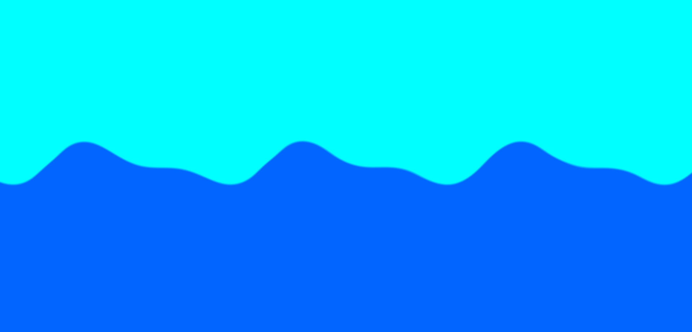

# Water Waves Shader (WebGL)

An interactive water shader with a mouse ripple effect. Implemented in pure WebGL without third-party libraries.

## Demo

## How to run

1. Upload the HTML file `index.html`.
2. Open in your browser (Chrome / Firefox)
3. Move the mouse - enjoy ripple waves 🌊

## What's inside

- Fragment and vertex shader
- Dynamic time update (`u_time`)
- Mouse interaction (`u_mouse`)
- Canvas WebGL without frameworks

## Author
gorodroz
https://github.com/gorodroz
